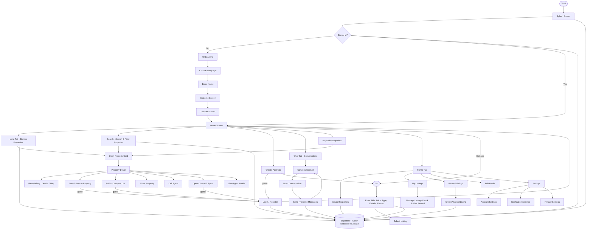
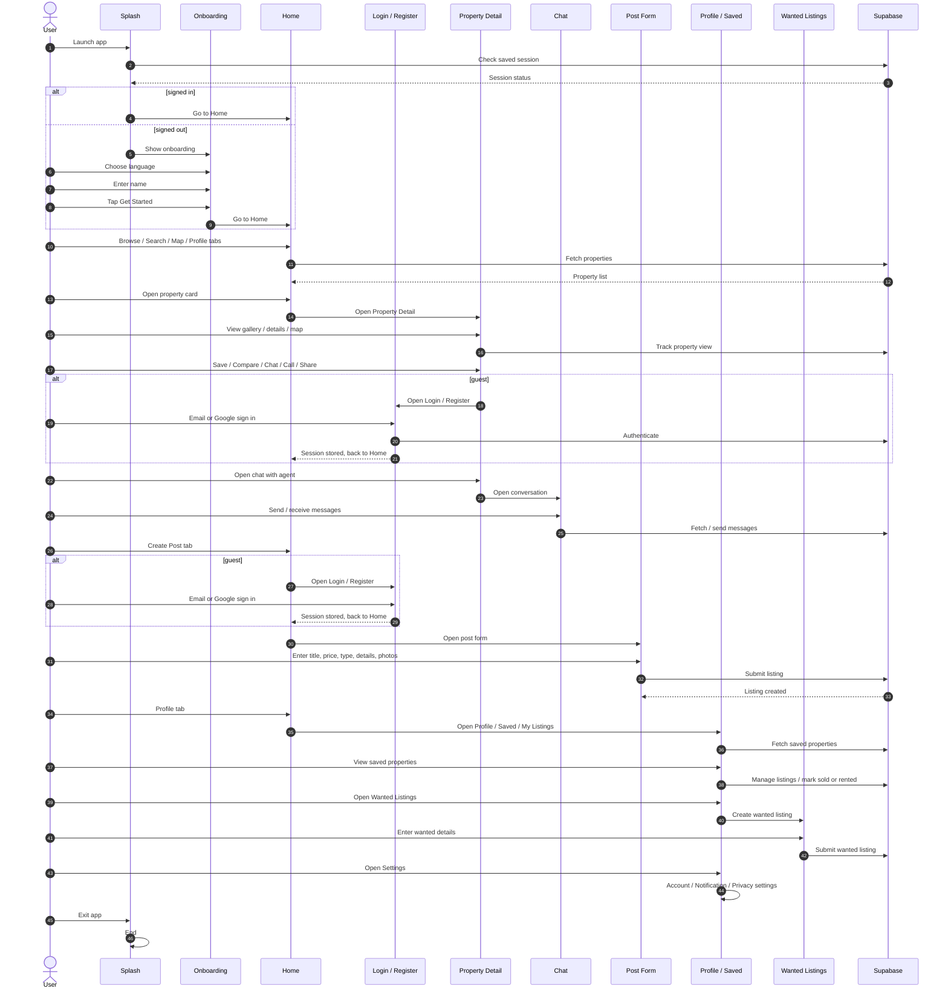
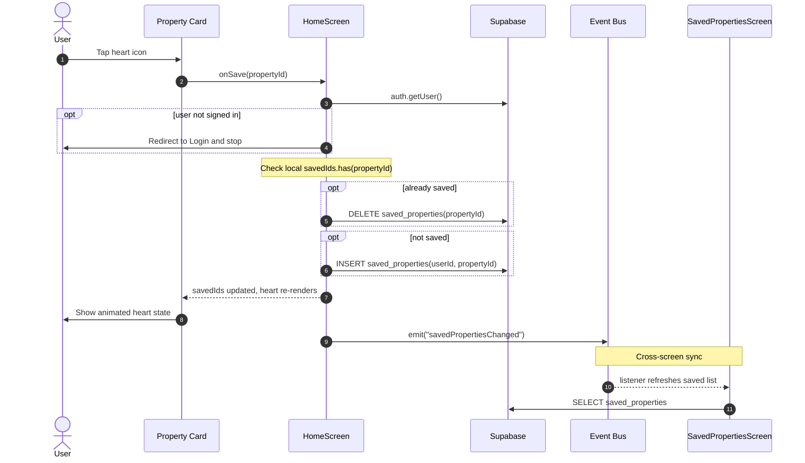
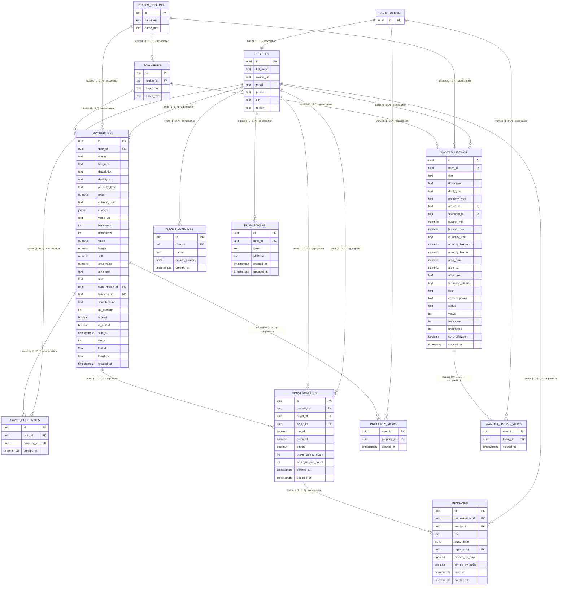
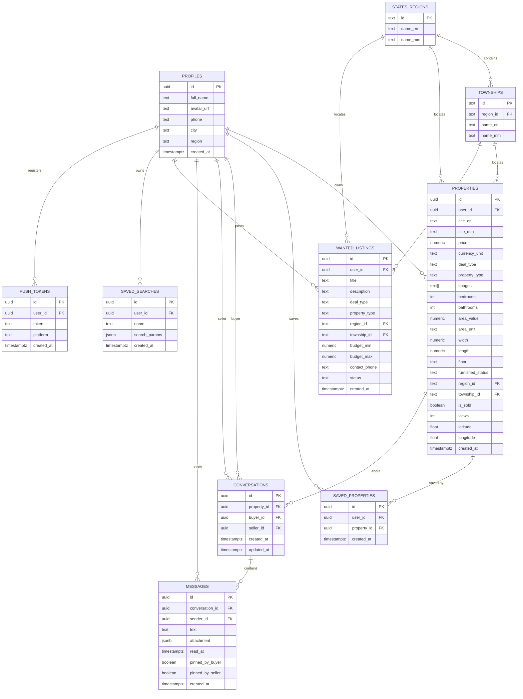
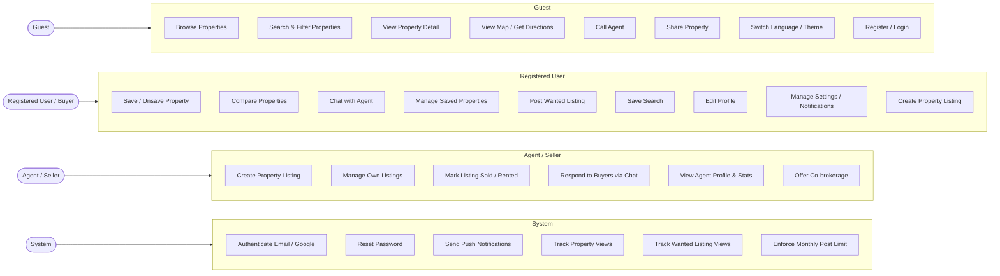

# Nestfinder — Diagrams

UML / architecture diagrams for the Nestfinder (Expo + Supabase) app. Each diagram lives as a standalone Mermaid `.mmd` file and is embedded below so GitHub renders it in this README.

| Diagram | File | Description |
| --- | --- | --- |
| Flow chart | [flowchart.mmd](./flowchart.mmd) | App-level navigation and feature flow |
| Sequence diagram (app flow) | [sequence-app.mmd](./sequence-app.mmd) | Full app flow: splash, onboarding, home tabs, login, property detail, chat, create post, profile/saved, wanted, settings |
| Sequence diagram (save flow) | [sequence.mmd](./sequence.mmd) | Save / unsave a property with cross-screen sync |
| Class diagram | [class.mmd](./class.mmd) | Supabase tables as ER-style tables with 1..* / 0..* relations |
| ER diagram | [er.mmd](./er.mmd) | Supabase database schema and relationships |
| Use case diagram | [usecase.mmd](./usecase.mmd) | Actors and their use cases (rendered as a flowchart; GitHub Mermaid has no `useCaseDiagram` support) |

## Flow chart

## Sequence diagram — app flow (from flowchart)

## Sequence diagram — save / unsave a property

## Class diagram

> Supabase tables modeled as ER-style tables (classes = DB entities). Relation symbols: `||` = 1..1, `o|` = 0..1, `}o` = 0..*, `}|` = 1..*. Relationship types: **association** (independent life), **aggregation** (part can outlive the whole), **composition** (part is deleted with the whole).

## ER diagram

## Use case diagram

> GitHub Mermaid does not support the native `useCaseDiagram` type, so the use case model is rendered as a flowchart below. Use cases are grouped per actor.

