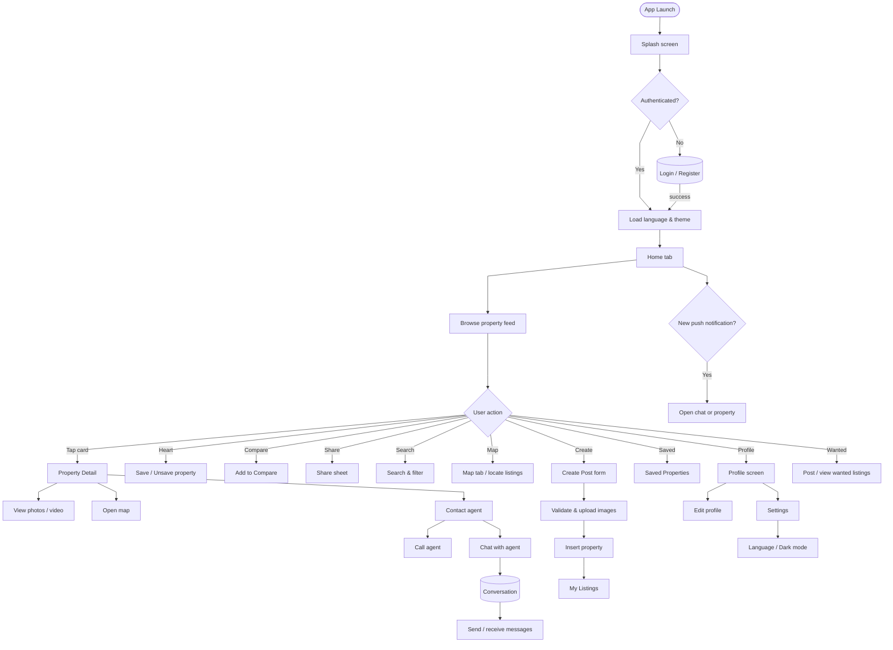
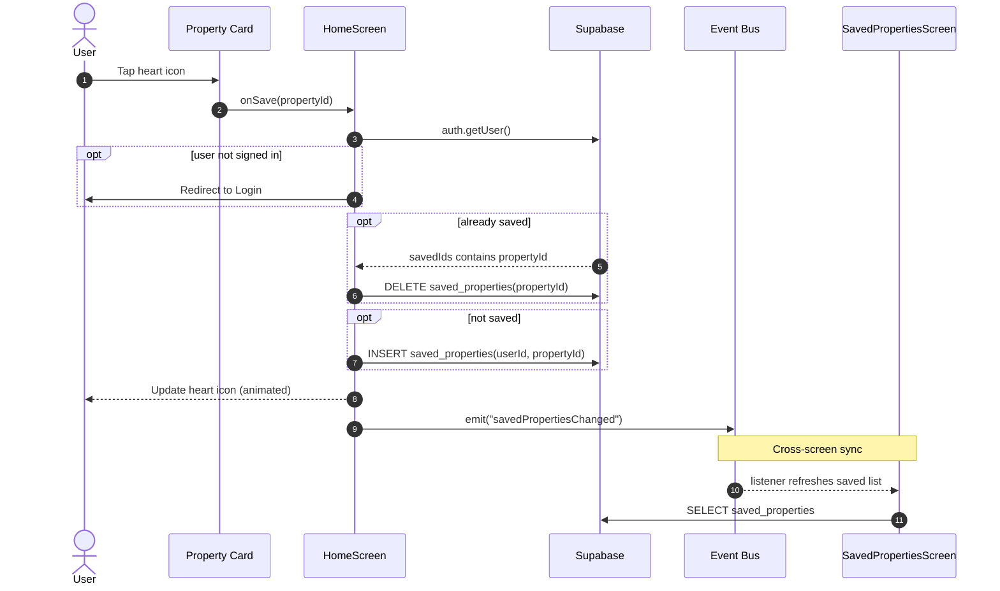
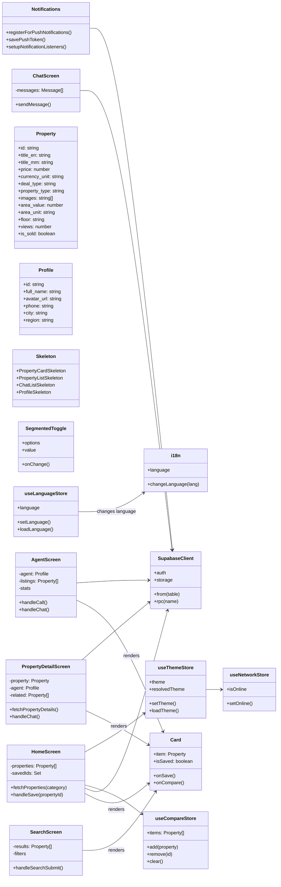

# Nestfinder — Diagrams

UML / architecture diagrams for the Nestfinder (Expo + Supabase) app. Each diagram lives as a standalone Mermaid `.mmd` file and is embedded below so GitHub renders it in this README.

| Diagram | File | Description |
| --- | --- | --- |
| Flow chart | [flowchart.mmd](./flowchart.mmd) | App-level navigation and feature flow |
| Sequence diagram | [sequence.mmd](./sequence.mmd) | Save / unsave a property with cross-screen sync |
| Class diagram | [class.mmd](./class.mmd) | Main screens, components, stores and services |
| ER diagram | [er.mmd](./er.mmd) | Supabase database schema and relationships |
| Use case diagram | [usecase.mmd](./usecase.mmd) | Actors and their use cases |

## Flow chart



## Sequence diagram — save / unsave a property



## Class diagram



## ER diagram


## Use case diagram

```mermaid
useCaseDiagram
    actor Guest
    actor User as "Registered User (Buyer)"
    actor Agent as "Registered User (Seller / Agent)"
    actor System

    Guest --> (Browse Properties)
    Guest --> (Register Account)
    Guest --> (Login)
    Guest --> (Switch Language)

    User --> (Search & Filter Properties)
    User --> (View Property Detail)
    User --> (Save / Unsave Property)
    User --> (Compare Properties)
    User --> (View Map / Get Directions)
    User --> (Call Agent)
    User --> (Chat with Agent)
    User --> (Manage Saved Properties)
    User --> (Post Wanted Listing)
    User --> (Save Search)
    User --> (Edit Profile)
    User --> (Change Settings)
    User --> (Toggle Dark Mode)

    Agent --> (Create Property Listing)
    Agent --> (Manage Own Listings)
    Agent --> (Respond to Buyers via Chat)
    Agent --> (View Agent Profile)

    System --> (Authenticate via Email / Google)
    System --> (Send Push Notifications)
    System --> (Track Property Views)
    System --> (Enforce Monthly Post Limit)
```
